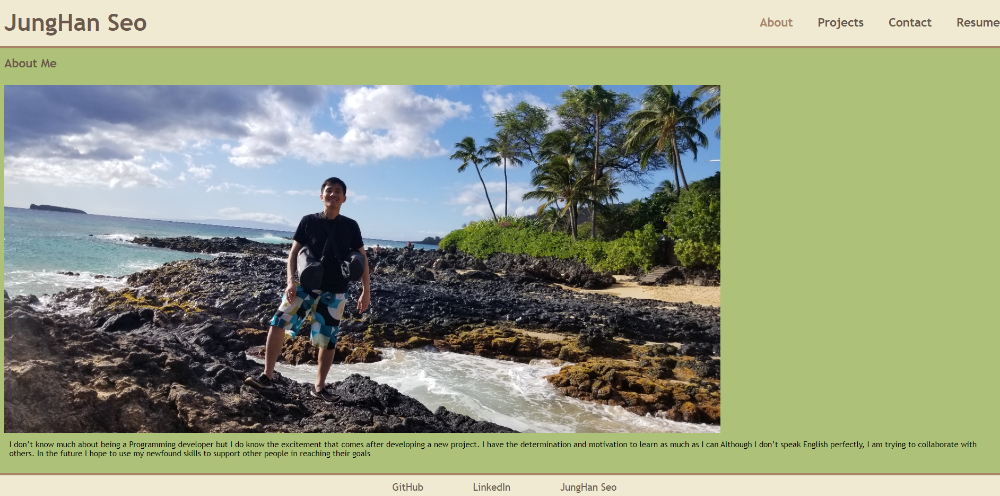

  # Junghan's Portfolio

  

  ## Description
  This is a portfolio I wrote using React to showcase my full stack development skills and some of the projects I have worked on.

  ## Link
  [My Portfolio](https://junghan84.github.io/React-Portfolio/)

  

  ## Table of Contents
  * [Description](#description)
  * [Link](#link)
  * [Usage](#usage)
  * [License](#license)

  ## Usage
  You can view my portfolio at the Link listed above.

  ## License
  This software is licensed under the [MIT license](https://choosealicense.com/licenses/mit/).

